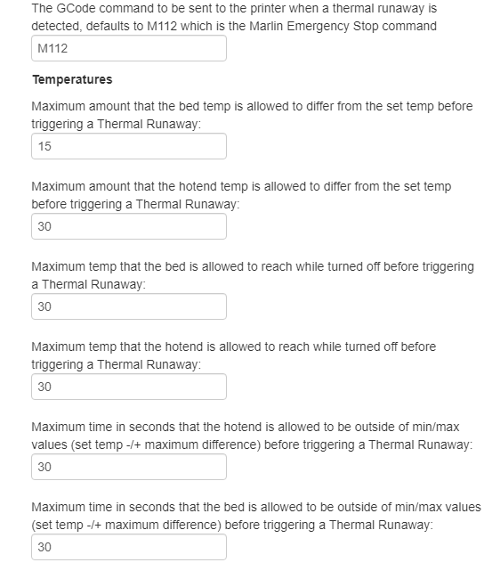

# Thermal Runaway

#### An Octoprint plugin to provide some basic thermal runaway protection.
__What this plugin does:__  
Sends the configured GCode command when a heater on the printer is outside of configured maximum/minimum temperatures and not heading towards the set temperature  

__What this plugin _does not_ do:__ 
This plugin does not stop a thermal runaway, it just sends a GCode command, and it is up to you to find a way to handle that GCode command appropriately. As such, *I strongly recommend that you __watch your printer at all times__*

## Setup

Install via the bundled [Plugin Manager](https://docs.octoprint.org/en/master/bundledplugins/pluginmanager.html)
or manually using this URL:

    https://github.com/AlexVerrico/Octoprint-ThermalRunaway/archive/master.zip

## Configuration
This plugin has the following configuration options:

### Disclaimer:  
I, the plugin author, strongly recommend that you __NEVER__ leave you printer unattended while powered. This plugin is not a replacement for [firmware thermal runaway detection](https://3dprinting.stackexchange.com/a/8467). I, the plugin author, __cannot__ be held responsible for any damage to equipment or injuries that may arise from leaving your 3D Printer unattended. I, the plugin author, make no guarantees that this plugin will work or continue to work.

## Contributing

All Pull Requests **<u>MUST</u>** be made to the devel branch, otherwise they will be ignored. 
Please ensure that you follow the style of the code (eg. use spaces not tabs, etc) 
Please open an issue to discuss what you features you want to add / bugs you want to fix _before_ working on them, as this avoids 2 people submitting a PR for the same feature/bug.